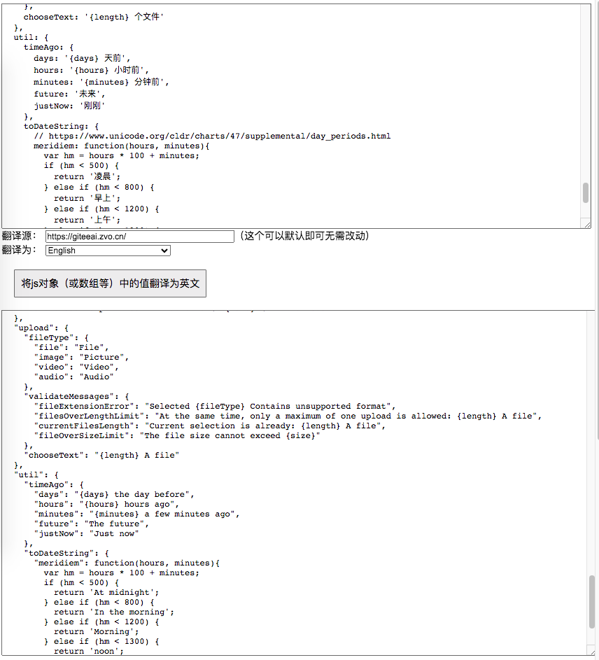

在线使用：  https://doc.zvo.cn/translate/extend/layui-i18n-object-translate/index.html  
这个 index.html 便是当前目录下的 index.html 文件，无任何三方依赖，传到哪里都能用。

## 简介
对 Layui 的 i18n 模块中，定义的 多语言配置文件进行翻译。  
可直接将多语言配置文件的对象赋值进去，即可直接翻译为其他语言输出  
它提供了对 layui i18n 语言配置文件的一键整体翻译的能力，使用时，直接将语言配置文件进行全部复制过来，指定目标语言，即可自动将语言配置的值翻译为你想要的语种。

## 使用
它提供在线使用的方式，网址：  
http://doc.zvo.cn/translate/extend/layui-i18n-object-translate/index.html

## 说明
1. 它是有 [开源中国GiteeAI](https://ai.gitee.com/?source=translate.js) 提供的大模型提供算力支持，打开即可直接使用。  
1. 如果你想私有部署它，你可以将 [点此下载这个index.html](index.html) ，放到你自己服务器托管，即可直接访问使用。  
1. 如果你使用中有异常、出错等，可反馈至 https://gitee.com/mail_osc/translate/issues
1. 另外如果你有动态文本没法固定配置文本的，也可以直接使用我定做的 [translate.js 的 layui ai 翻译插件](../layui/) ，引入后它会自动寻找页面中需要翻译的文本进行自动翻译。如果使用中遇到异常都可以[联系我](http://translate.zvo.cn/4030.html) 获得免费帮助支持