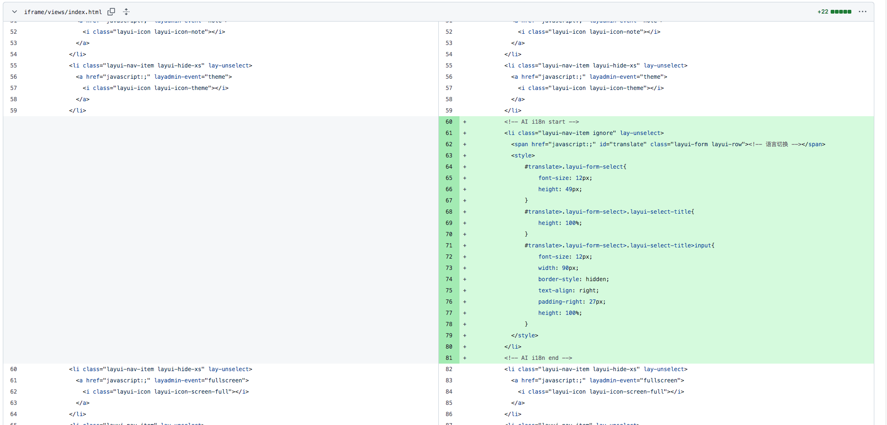
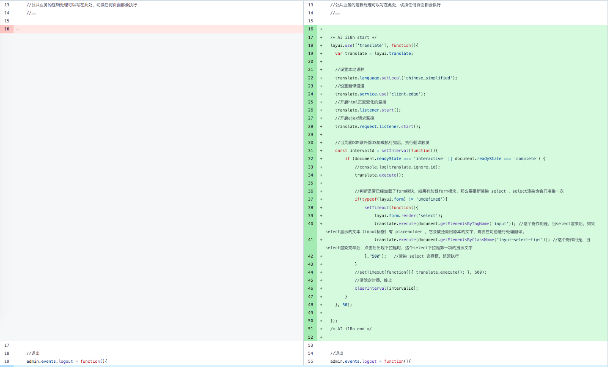

translate.js 在 layui admin 的 iframe 版本中的使用

## 改动项

#### 1. 修改 views/index.html 
需要增加代码，以在右上角显示切换语言的入口：

````
<!-- AI i18n start -->
<li class="layui-nav-item ignore" lay-unselect>
<span href="javascript:;" id="translate" class="layui-form layui-row"><!-- 语言切换 --></span>
<style>
    #translate>.layui-form-select{
        font-size: 12px;
        height: 49px;
    }
    #translate>.layui-form-select>.layui-select-title{
        height: 100%;
    }
    #translate>.layui-form-select>.layui-select-title>input{
        font-size: 12px;
        width: 90px;
        border-style: hidden;
        text-align: right;
        padding-right: 27px;
        height: 100%;
    }
</style>  
</li>
<!-- AI i18n end -->
````
增加代码的位置，如图所示：  
  
[点此查看修改之后的 views/index.html 文件](./views/index.html)

#### 2. 修改 res/modules/common.js 
需要增加代码，是所有页面都能支持多语言切换能力：
````
/* AI i18n start */
layui.use(['translate'], function(){
	var translate = layui.translate;

	//设置本地语种
	translate.language.setLocal('chinese_simplified');
	//设置翻译通道
	translate.service.use('client.edge');
	//开启html页面变化的监控
	translate.listener.start();    
	//开启ajax请求监控
	translate.request.listener.start();

	//当页面DOM跟外部JS加载执行完后，执行翻译触发
	const intervalId = setInterval(function(){
	    if (document.readyState === 'interactive' || document.readyState === 'complete') {
	        //console.log(translate.ignore.id);
	        translate.execute();

	        //判断是否已经加载了form模块，如果有加载form模块，那么要重新渲染 select ，select渲染也会只渲染一次
	        if(typeof(layui.form) != 'undefined'){
	            setTimeout(function(){
	                layui.form.render('select');
	                translate.execute(document.getElementsByTagName('input')); //这个得作用是，当select渲染后，如果select显示的文本（input标签）有 placeholder ，它会被还原回原本的文字，需要在对他进行处理翻译。
	                translate.execute(document.getElementsByClassName('layui-select-tips')); //这个得作用是，当select渲染完毕后，点击后出现下拉框时，这个select下拉框第一项的提示文字
	            },"500");   //渲染 select 选择框，延迟执行
	        }
	        //setTimeout(function(){ translate.execute(); }, 500);
	        //清除定时器，终止
	        clearInterval(intervalId);
	    }
	}, 50);
});
/* AI i18n end */
````
增加代码的位置，如图所示：  

[点此查看修改之后的 res/modules/common.js  文件](./res/modules/common.js)

#### 3. 新增 res/modules/translate.js
这个文件下载：  https://gitee.com/mail_osc/translate/raw/master/extend/layuiAdmin/iframe/res/modules/translate.js
