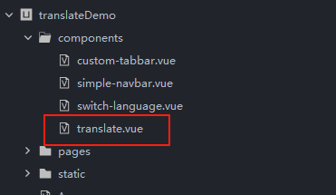
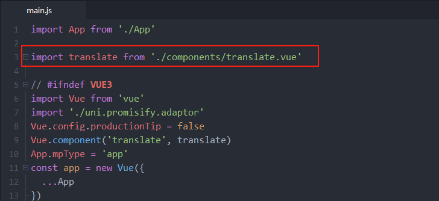
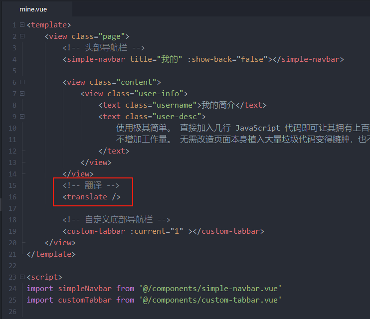

在 uniapp 中使用translate.js

## 使用
使用参考： [在 vue3 中使用 translate.js](../vue/vue3/) 可以完全按照vue3的使用方式来进行使用。  

uniapp 打包发布 APP 后也是可以完美使用的，但是如果发布微信小程序，微信小程序里是不能用这个翻译的，这个需要知晓。(主要是微信生态主要是国内生态，没那么多多语言切换需求就没适配。如果你出资赞助适配，也是可以的)  
另外uniapp如果要打包app，打包app后翻译如果不能正常用，可以参考下面步骤进行调整 ，里面也有APP的相关demo示例以供参考
  

在 uniapp 中使用translate.js主要引用了2个组件：

- translate.vue
- switch-language.vue

## translate.vue

1. 全局注册后在需要翻译的页面引用该组件即可。
2. 主要功能是初始化和启动翻译。
3. 额外提供一个响应式的属性 `translateId` 用来手动触发翻译刷新。  

## switch-language.vue

1. 切换语言组件，使用了renderjs来实现语言切换。
2. 可自行调整样式。

## 注意事项

1. 不支持微信小程序。
2. 页面使用 `.vue` 而不是 `.nvue`。
3. app环境的原生组件不在DOM树中，会翻译不了，所以尽可能使用UI框架的组件或者自定义组件。

