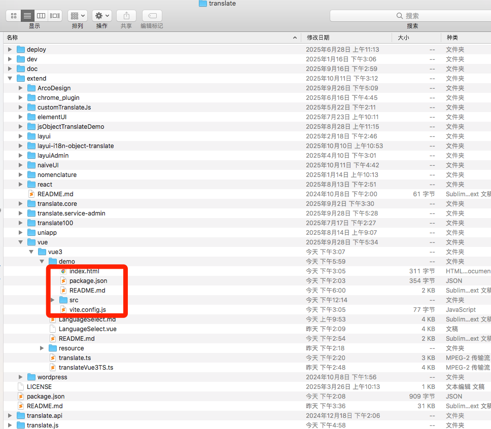
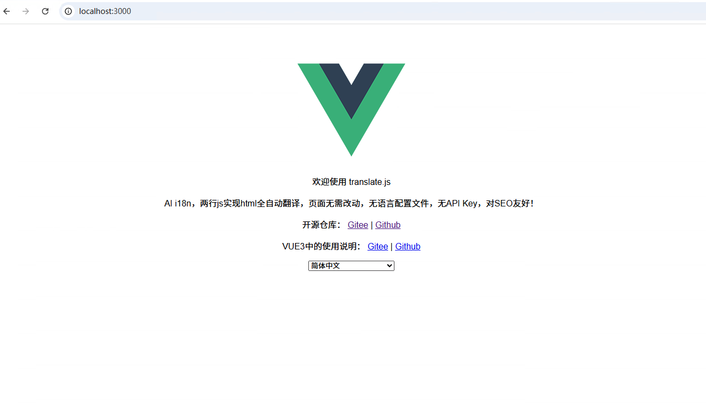

VUE3 中 使用 translate.js 的 Demo

## 第一步：拉下当前 Demo 项目来 

  
将这几个文件下载到你本地文件夹下，注意你本地路径里不要有中文 。  
为了省事，你可以直接git拉下我们整个开源仓库的源码即可。  

## 第二步：跑起项目来

1. 使用命令行，到你下载的这个本地文件夹目录中
2. 执行 ````npm install```` 进行安装 package.json 中的依赖  
3. 执行 ````npm run dev```` 即可运行起来
4. 访问 ````http://localhost:3000```` 即可看到页面  

  

